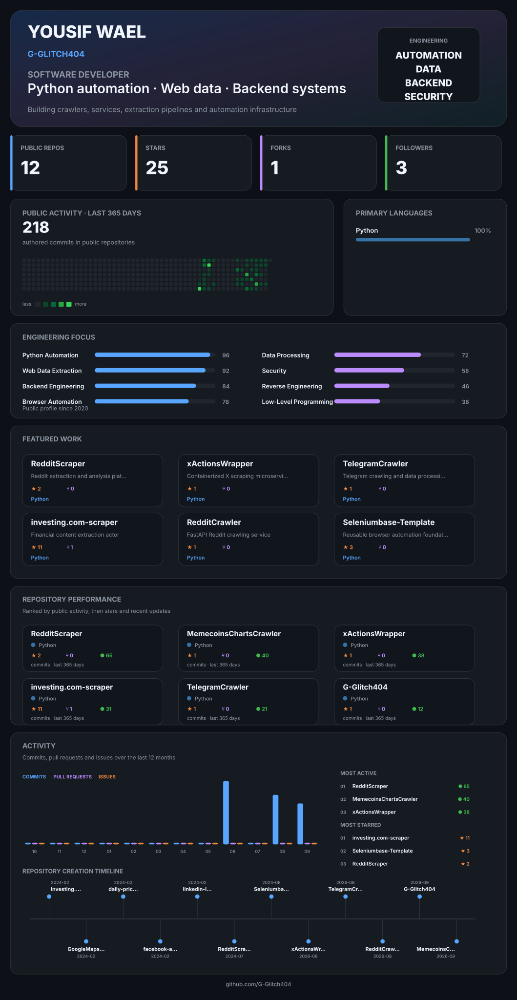

<div align="center">



<br>

<a href="https://apify.com/glitch_404">Apify</a>
&nbsp;&nbsp;·&nbsp;&nbsp;
<a href="https://www.linkedin.com/in/glitch404/">LinkedIn</a>
&nbsp;&nbsp;·&nbsp;&nbsp;
<a href="https://github.com/G-Glitch404?tab=repositories">Repositories</a>

</div>

---

## About

I build software around Python automation, web data extraction, backend services, and data processing.

My public work focuses on turning difficult or repetitive data-collection workflows into structured, reusable systems.

Current areas of interest:

`Python Automation` · `Web Scraping` · `Browser Automation` · `Websockets & APIs` · `Docker` · `PostgreSQL` · `Data Pipelines` · `Security` · `Reverse Engineering`

## Selected Work

| Project                                                                       | Focus                                               |
|-------------------------------------------------------------------------------|-----------------------------------------------------|
| [RedditScraper](https://github.com/G-Glitch404/RedditScraper)                 | Reddit extraction, crawling, filtering and analysis |
| [xActionsWrapper](https://github.com/G-Glitch404/xActionsWrapper)             | Dockerized X scraping microservice                  |
| [TelegramCrawler](https://github.com/G-Glitch404/TelegramCrawler)             | Telegram crawling, enrichment and streaming         |
| [investing.com-scraper](https://github.com/G-Glitch404/investing.com-scraper) | Structured financial content extraction             |
| [RedditCrawler](https://github.com/G-Glitch404/RedditCrawler)                 | FastAPI-based Reddit crawling                       |
| [Seleniumbase-Template](https://github.com/G-Glitch404/Seleniumbase-Template) | Reusable browser automation foundation              |

## Engineering Approach

```text
collect → normalize → enrich → analyze → expose → automate
I am particularly interested in building reliable systems at the intersection of automation, data extraction, backend engineering, and security.

Private Work

Some of my larger projects are private. This profile intentionally highlights the public work that best represents my engineering direction.

<sub>Dashboard statistics are generated automatically from public GitHub data.</sub>

```
---
